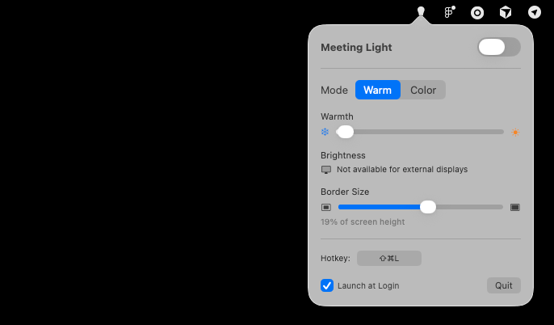

# Meeting Light

A simple macOS menu bar app that creates a colored light border around your screen to act as fill light during video calls.



## Install

[Download MeetingLight.dmg](https://github.com/artyom-ivanov/meeting-light/releases/download/1.0.0/MeetingLight.dmg) — open it and drag the app to Applications.

## Features

- **Light border overlay** that sits above all apps (including fullscreen)
- **Two modes**: Warm (white to orange) and Color (full hue spectrum)
- **Adjustable border size** as a percentage of screen height
- **Global hotkey** to toggle on/off (default: Cmd+Shift+L, recordable)
- **Launch at Login** support
- Click-through — the border never blocks your mouse
- Fades to 20% opacity when you hover over it

## Build from source

Requires Xcode 14+ and macOS 13+.

```bash
swift build
swift run MeetingLight
```

To create a distributable `.app` bundle:

```bash
./scripts/build-app.sh
```

The signed app and DMG will be in `.build/`.

## Usage

1. Click the lightbulb icon in the menu bar to open settings
2. Flip the toggle or press your hotkey to activate the border
3. Adjust warmth/color, border size, and hotkey to your liking
